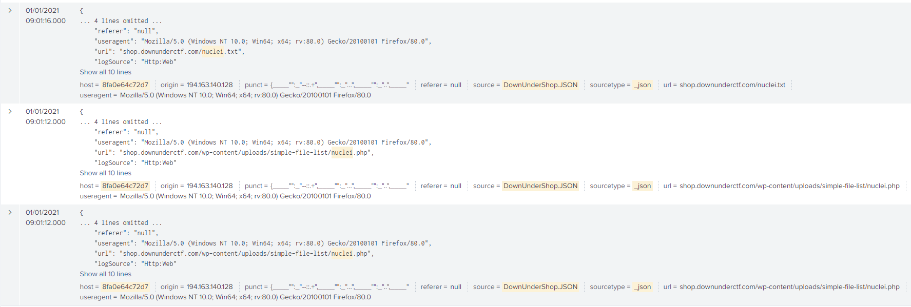

# Shop-I'm just looking!

Points: 50  
Easy  
264 Solves 

We've seen some vulnerability scanning activity against us!

What was the name of the tool used?

Flag format: Name of the tool used, case insensitive

Author: Cake#4096

Browsing data I stumbled upon interesting entries, and Googled nuclei: `Fast and customisable vulnerability scanner based on simple YAML based DSL.`

Flag: nuclei

*(Note: No DUCTF{} format)*
