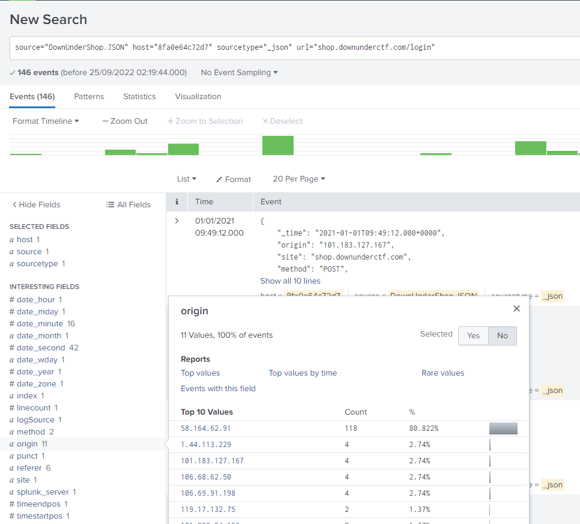
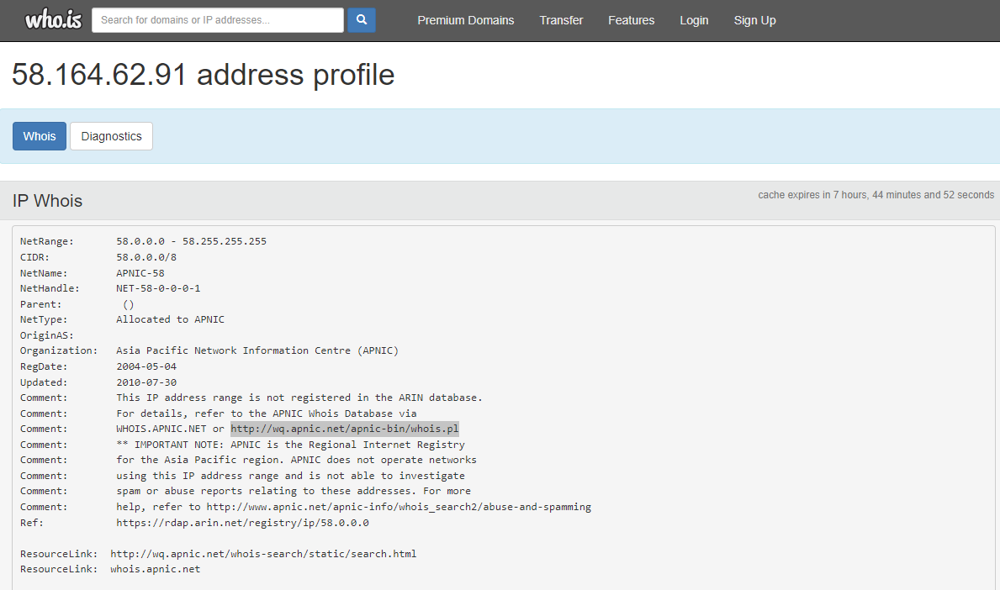
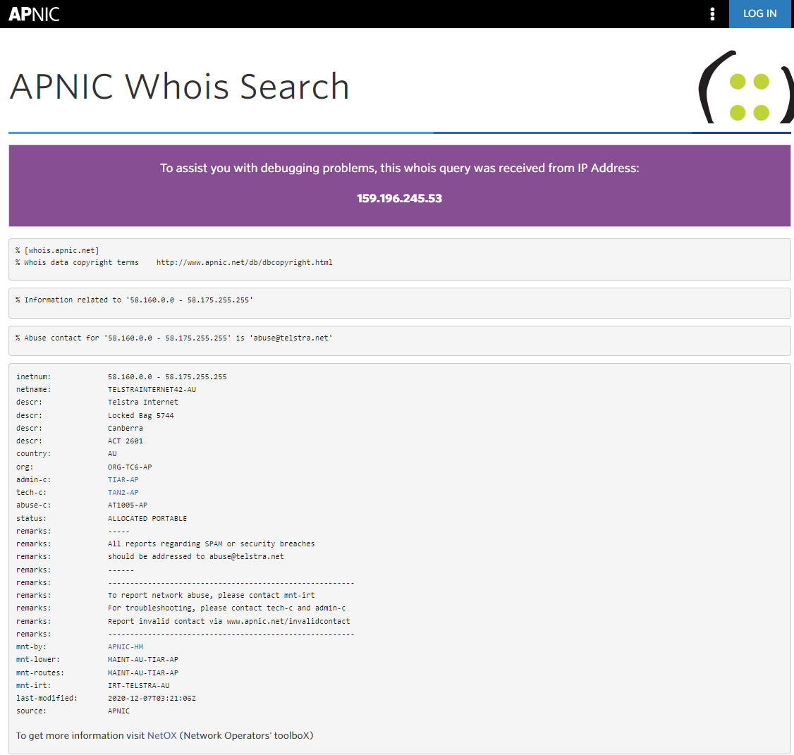

# Shop-Knock Knock Knock

Points: 50  
Easy  
381 Solves 

Looks like there's been a bruteforce/password spray attempt against the website!

What's the contact email for the ISP of the attacker's IP?

Flag format: Email address, case insensitive

Author: Cake#4096

-------------

Looking at login attempts:

IP stands out: 58.164.62.91

Searching whois.is:
https://who.is/whois-ip/ip-address/58.164.62.91

Points me to apnic.net.

Trying all email addresses unsuccessfully, then trying other formats.

Flag: abuse@telstra.net

*(Note: No DUCTF{} format)*
