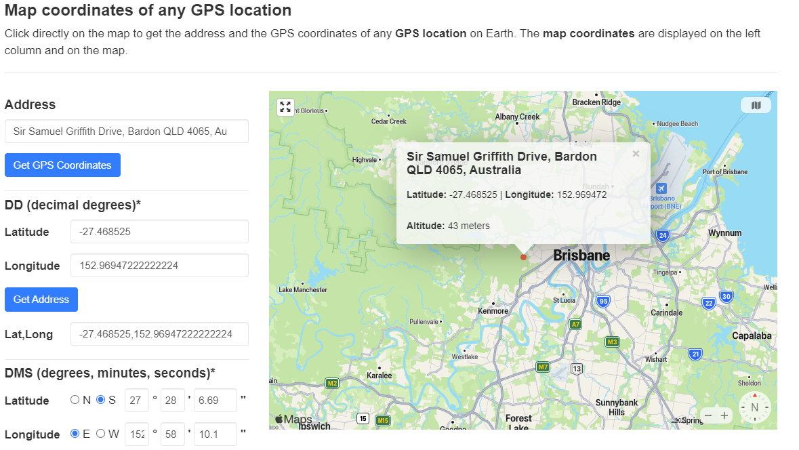
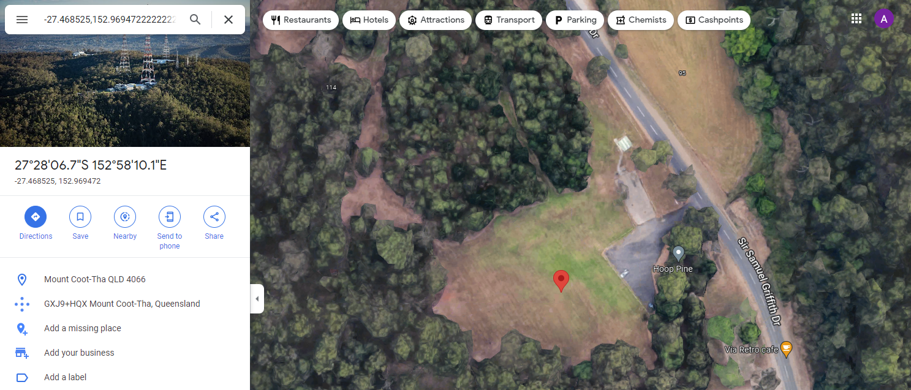

# Bird's eye view!

Points: 50  
Easy  
502 Solves 

What a nice spot to have a picnic, EXAMINE the image and discover where this was taken.

Flag format: The name of the area with no spaces, case insensitive

Author: Yo_Yo_Bro


```
$ exiftool view.jpg    
ExifTool Version Number         : 12.44
File Name                       : view.jpg
Directory                       : .
File Size                       : 4.0 MB
File Modification Date/Time     : 2022:09:23 13:08:19+10:00
File Access Date/Time           : 2022:09:25 15:54:49+10:00
File Inode Change Date/Time     : 2022:09:25 15:54:49+10:00
File Permissions                : -rw-r--r--
File Type                       : JPEG
File Type Extension             : jpg
MIME Type                       : image/jpeg
Exif Byte Order                 : Big-endian (Motorola, MM)
Orientation                     : Horizontal (normal)
X Resolution                    : 72
Y Resolution                    : 72
Resolution Unit                 : inches
Modify Date                     : 2022:09:09 16:25:22
Y Cb Cr Positioning             : Centered
Exposure Time                   : 1/320
F Number                        : 2.8
Exif Version                    : 1337
Components Configuration        : Y, Cb, Cr, -
Compressed Bits Per Pixel       : 3.512687111
Shutter Speed Value             : 1/320
Aperture Value                  : 2.8
Exposure Compensation           : +2/3
Max Aperture Value              : 2.8
Subject Distance                : 0 m
Focal Length                    : 4.5 mm
Flashpix Version                : 0100
Color Space                     : sRGB
Exif Image Width                : 4000
Exif Image Height               : 2250
Interoperability Version        : 0100
Exposure Index                  : undef
File Source                     : Digital Camera
Scene Type                      : Directly photographed
Custom Rendered                 : Normal
Exposure Mode                   : Auto
Digital Zoom Ratio              : 1
Scene Capture Type              : Standard
Gain Control                    : None
Subject Distance Range          : Unknown
Serial Number                   : 1SFOJ8Q0AB08J9
Offset Schema                   : 2921
GPS Version ID                  : 2.3.0.0
GPS Latitude Ref                : South
GPS Longitude Ref               : East
GPS Altitude Ref                : Above Sea Level
Padding                         : (Binary data 2060 bytes, use -b option to extract)
Compression                     : JPEG (old-style)
Thumbnail Offset                : 21428
Thumbnail Length                : 9682
About                           : DJI Meta Data
Format                          : image/jpg
Absolute Altitude               : +84.13
Relative Altitude               : +12.70
Gimbal Roll Degree              : +0.00
Gimbal Yaw Degree               : +0.00
Gimbal Pitch Degree             : +0.00
Flight Roll Degree              : +0.00
Flight Yaw Degree               : +68.60
Flight Pitch Degree             : +1.60
Cam Reverse                     : 0
Gimbal Reverse                  : 0
Version                         : 7.0
Has Settings                    : False
Has Crop                        : False
Already Applied                 : False
MPF Version                     : 0010
Number Of Images                : 2
MP Image Flags                  : Dependent child image
MP Image Format                 : JPEG
MP Image Type                   : Large Thumbnail (VGA equivalent)
MP Image Length                 : 257181
MP Image Start                  : 3986185
Dependent Image 1 Entry Number  : 0
Dependent Image 2 Entry Number  : 0
Image UID List                  : (Binary data 66 bytes, use -b option to extract)
Total Frames                    : 1
Image Width                     : 4000
Image Height                    : 2250
Encoding Process                : Baseline DCT, Huffman coding
Bits Per Sample                 : 8
Color Components                : 3
Y Cb Cr Sub Sampling            : YCbCr4:2:2 (2 1)
Aperture                        : 2.8
Image Size                      : 4000x2250
Megapixels                      : 9.0
Shutter Speed                   : 1/320
Thumbnail Image                 : (Binary data 9682 bytes, use -b option to extract)
GPS Altitude                    : 84.1 m Above Sea Level
GPS Latitude                    : 27 deg 28' 6.69" S
GPS Longitude                   : 152 deg 58' 10.10" E
Preview Image                   : (Binary data 257181 bytes, use -b option to extract)
Focal Length                    : 4.5 mm
GPS Position                    : 27 deg 28' 6.69" S, 152 deg 58' 10.10" E
```

I wasn't sure how to put that format into Google Maps.. Using https://www.gps-coordinates.net/



Copy/paste Lat,Long into Google Maps.



Flag: DUCTF{HoopPine}

