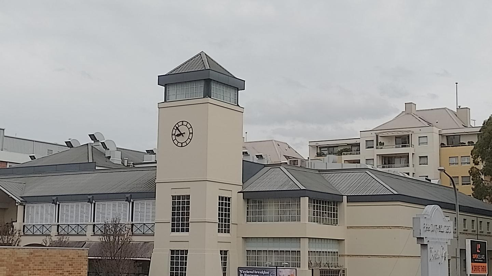
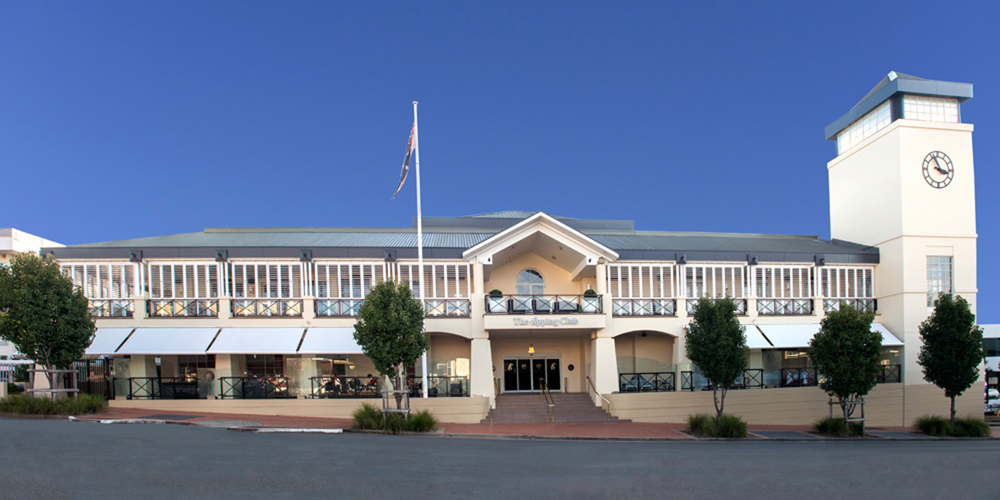

# Pre-Kebab Challenge

Points: 50  
Easy
294 Solves 

Where was the photo taken from?

Flag format: Building name with no spaces, case insensitive
Flag example: DUCTF{SydneyOperaHouse}

Author: NoSurf#3704!



-------------

exiftool:

```
$ exiftool osintgeo.jpg 
ExifTool Version Number         : 12.44
File Name                       : osintgeo.jpg
Directory                       : .
File Size                       : 134 kB
File Modification Date/Time     : 2022:09:23 13:08:04+10:00
File Access Date/Time           : 2022:09:25 09:10:51+10:00
File Inode Change Date/Time     : 2022:09:25 09:10:51+10:00
File Permissions                : -rw-r--r--
File Type                       : JPEG
File Type Extension             : jpg
MIME Type                       : image/jpeg
JFIF Version                    : 1.01
Resolution Unit                 : None
X Resolution                    : 1
Y Resolution                    : 1
Image Width                     : 1440
Image Height                    : 810
Encoding Process                : Baseline DCT, Huffman coding
Bits Per Sample                 : 8
Color Components                : 3
Y Cb Cr Sub Sampling            : YCbCr4:2:0 (2 2)
Image Size                      : 1440x810
Megapixels                      : 1.2
```

No useful exif data.

Google reverse image search didn't provide any hints, although the text conversion wasn't complete enough `SUPERCELLARS Weekend breakfast C In Rairsona KDRIVE THRU`

Over to yandex.com for reverse image search where it returned this image:



That shows "The Epping Club".

Using Google maps I confirm that's the location.

Reviewing the question, it's asking where was this photo taken. Walking around using street view it's obvious the photo was taken from an elevated position.

Looking at the map, and going back further, I can see The Epping Hotel.

flag: DUCTF{TheEppingHotel}

