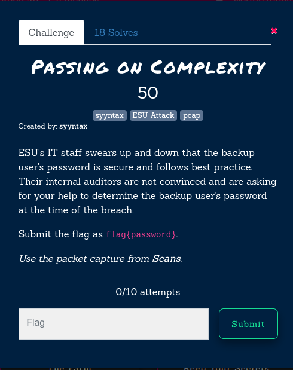
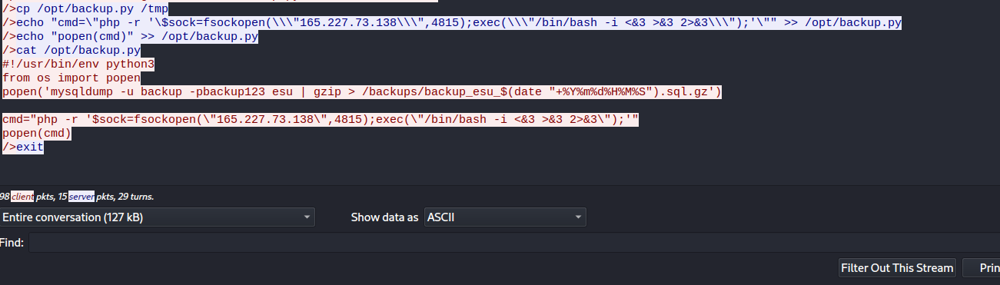

Passing On Complexity
50 points

From the shells challenge, I was looking for info.php, and following the conversation for that flow, one of the last lines is `popen('mysqldump -u backup -pbackup123 esu | gzip > /backups/backup_esu_$(date "+%Y%m%d%H%M%S").sql.gz')`

flag{backup123}

