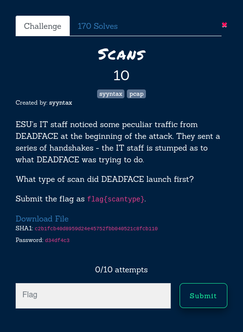
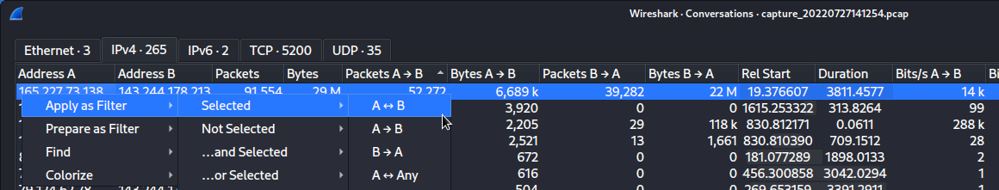
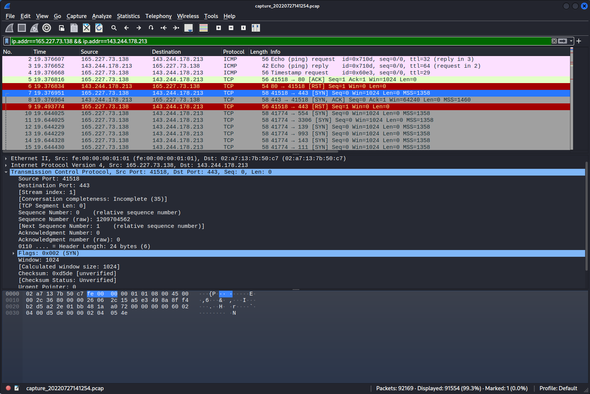

Scans
10 points



Link: https://tinyurl.com/352bfsn4

```
$ wget https://tinyurl.com/352bfsn4                           
--2022-10-15 06:17:53--  https://tinyurl.com/352bfsn4
Resolving tinyurl.com (tinyurl.com)... 104.20.138.65, 172.67.1.225, 104.20.139.65, ...
Connecting to tinyurl.com (tinyurl.com)|104.20.138.65|:443... connected.
HTTP request sent, awaiting response... 301 Moved Permanently
Location: https://cyberhacktics.sfo2.digitaloceanspaces.com/DEADFACECTF2022/Challenges/pcap01/capture_20220727141254.zip [following]
--2022-10-15 06:17:53--  https://cyberhacktics.sfo2.digitaloceanspaces.com/DEADFACECTF2022/Challenges/pcap01/capture_20220727141254.zip
Resolving cyberhacktics.sfo2.digitaloceanspaces.com (cyberhacktics.sfo2.digitaloceanspaces.com)... 138.68.32.225
Connecting to cyberhacktics.sfo2.digitaloceanspaces.com (cyberhacktics.sfo2.digitaloceanspaces.com)|138.68.32.225|:443... connected.
HTTP request sent, awaiting response... 200 OK
Length: 24520099 (23M) [application/zip]
Saving to: ‘352bfsn4’

352bfsn4                             100%[====================================================================>]  23.38M  7.97MB/s    in 2.9s    

2022-10-15 06:17:57 (7.97 MB/s) - ‘352bfsn4’ saved [24520099/24520099]

                                                                                                                                                  
┌──(daunce㉿kali)-[~/…/2022/deadface/trafficanalysis/scans]
└─$ file 352bfsn4    
352bfsn4: Zip archive data, at least v2.0 to extract, compression method=AES Encrypted
$ 7z x 352bfsn4 

7-Zip [64] 16.02 : Copyright (c) 1999-2016 Igor Pavlov : 2016-05-21
p7zip Version 16.02 (locale=en_AU.UTF-8,Utf16=on,HugeFiles=on,64 bits,2 CPUs Intel(R) Core(TM) i7-9850H CPU @ 2.60GHz (906ED),ASM,AES-NI)

Scanning the drive for archives:
1 file, 24520099 bytes (24 MiB)

Extracting archive: 352bfsn4
--
Path = 352bfsn4
Type = zip
Physical Size = 24520099

    
Enter password (will not be echoed):
Everything is Ok                  

Size:       31149800
Compressed: 24520099
```


Open up into Wireshark. Go to Statistics / Conversations, and sort by packets. There's one conversation that stands out, so apply that as a filter within Wireshark.



We can see a lot of [SYN] packets, and for a port that is open, ie: 443, when the target responds [SYN, ACK], the attacker sends [RST].

This indicates it's a SYN scan.

More info here: https://nmap.org/book/synscan.html




Flag: flag{syn}


