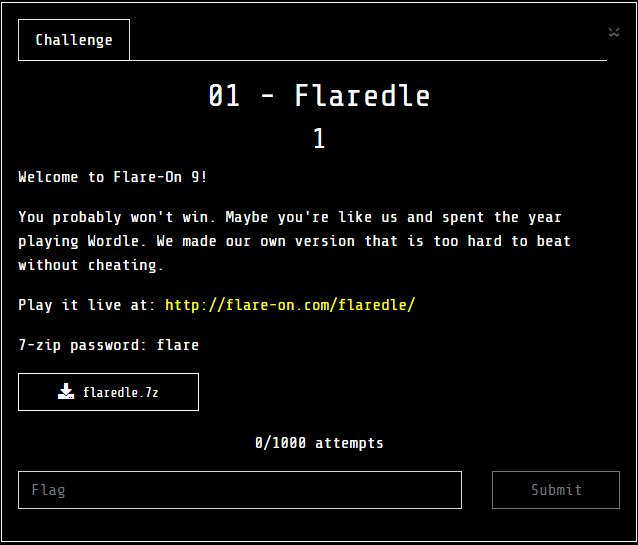
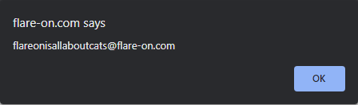

#01 - Flaredle



Play it live at: http://flare-on.com/flaredle/

The game plays like Wordle. Requiring to submit a 21 character word that must be in a list of words, and it shows yellow or green letters if they are in the word, or if they are in the right spot.

Looking at the downloaded files:
* index.html
* script.js
* style.css
* words.js

The interesting files are script.js showing the code the page uses, and words.js is a list of 21 letter words.

Looking at part of `script.js`:

```javascript
import { WORDS } from "./words.js";

const NUMBER_OF_GUESSES = 6;
const WORD_LENGTH = 21;
const CORRECT_GUESS = 57;
let guessesRemaining = NUMBER_OF_GUESSES;
let currentGuess = [];
let nextLetter = 0;
let rightGuessString = WORDS[CORRECT_GUESS];
```

`WORDS[57]` should be rightGuessString.. is that the answer?

`words.js`:

```javascript
export const WORDS = ['acetylphenylhydrazine',
	'aerobacteriologically',
	'alkylbenzenesulfonate',
	'aminoacetophenetidine',
...
    'establishmentarianism',
	'flareonisallaboutcats',
	'gastroenterocolostomy',
```

`flareonisallaboutcats` stands out here. But I'm an idiot and totally miscounted line numbers.

I went into in Chrome, and hit F12, Sources, script.js, and set a few breakpoints, and added rightGuessString to the watch variable window. I tried word enterocholecystostomy (WORD[55] - duh!). The watched variables updates and I saw rightGuessString: flareonisallaboutcats. 

On the next attempt I put in "flareonisallaboutcats". 



That's the flag!
