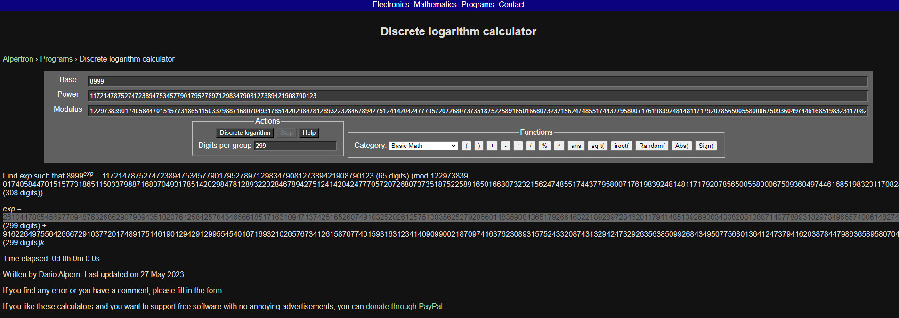

crypto/ezdlp

188 solves / 18 points

one easy dlp

Downloads: numbers.txt

```bash
└─$ cat numbers.txt 
g = 8999 
s = 11721478752747238947534577901795278971298347908127389421908790123 
p = 12297383901740584470151577318651150337988716807049317851420298478128932232846789427512414204247770572072680737351875225891650166807323215624748551744377958007176198392481481171792078565005580006750936049744616851983231170824931892761202881982041842121034608612146861881334101500003915726821683000760611763097

g^x = s mod p
flag = tjctf{x}
```

Googling around, DLP in crypto is Discrete Logarithm Problem.

Using the CLP calculator at https://www.alpertron.com.ar/DILOG.HTM, I could solve it.



I had to use the example to work out what value went where:
Example: Find the number n such that 7n ≡ 23 (mod 43241).

Type 7 in the Base input box, 23 in the Power input box and 43241 in the Mod input box. Then press the button named "Discrete logarithm".

Since it said 299 digits for the first result, I increased the digits oer group to 299 and pasted that as the flag.

Flag: tjctf{26104478854569770948763268629079094351020764258425704346666185171631094713742516526074910325202612575130356252792856014835908436517926646322189289728462011794148513926930343382081388714077889318297349665740061482743137948635476088264751212120906948450722431680198753238856720828205708702161666784517}
