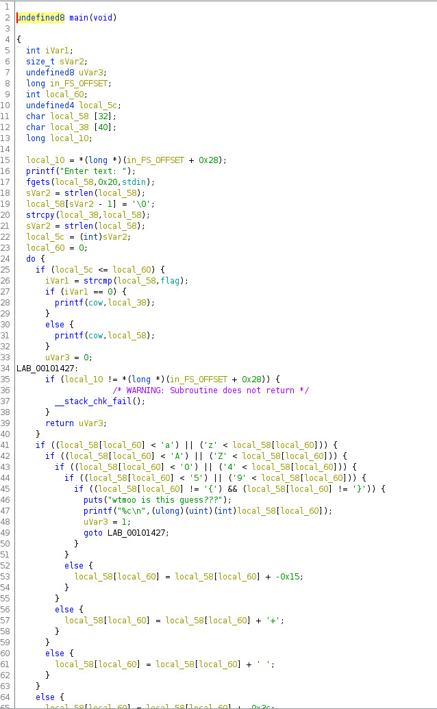
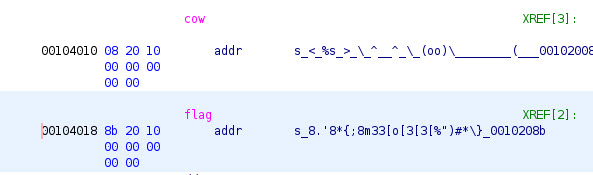

rev/wtmoo

233 solves / 15 points

My cow keeps eating all my flags...

Downloads: chall

```bash
└─$ ./cow-chall 
Enter text: abcdefgh
< %&'()*+, >
        \   ^__^
         \  (oo)\_______
            (__)\       )\/\
                ||----w |
                ||     ||
```

It looks to translate the ascii characters.

Looking at the source in Ghidra, it only allows a-z, A-Z, 0-9, {}, any other characters cause it to print `wtmoo is this a guess`.




Line 26 shows a mention of `flag`, and compares it to the input. It looks like the input has to match the flag.

Double clicking the `flag` entry takes me to another location, showing the contents - `8.'8*{;8m33[o[3[3[%")#*\}`.



I need to put in the flag so the output matches `8.'8*{;8m33[o[3[3[%")#*\}`. Using a table I can do it manually:

```
0123456789 input
[\]^_ !"#$ output

ABCDEFGHIJKLMNOPQRSTUVWXYZ input
abcdefghijklmnopqrstuvwxyz output

abcdefghijklmnopqrstuvwxyz input
%&'()*+,-./0123456789:;<=> output

{} input
{} output

8.'8*{;8m33[o[3[3[%")#*\}   output
tjctf{wtMoo0O0o0o0a7e8f1}   input 
```
Flag: tjctf{wtMoo0O0o0o0a7e8f1}


