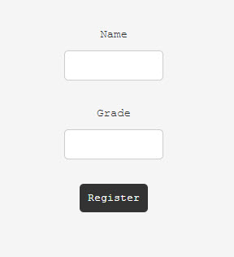

web/swill-squill

448 solves / 7 points

ezsql

Downloads:server.zip


Going to the page it prompts for name & grade.



Putting any user or grade shows an input box for notes. Notes are displayed on the screen.


Looking at the code provided, it's a Flask app. 
```Flask
@app.route('/register', methods=['POST'])
def post_register():
    name = request.form['name']
    grade = request.form['grade']

    if name == 'admin':
        return make_response(redirect('/'))

    res = make_response(redirect('/api'))
    res.set_cookie("jwt_auth", generate_token(name))

    c = conn.cursor()
    c.execute("SELECT * FROM users WHERE name == '"+name+"';")

```


Testing for SQL injection. ' OR 1=1--

Using ' OR 1=1-- for the username displays all the notes, including the flag.


Flag: tjctf{swill_sql_1y1029345029374}

